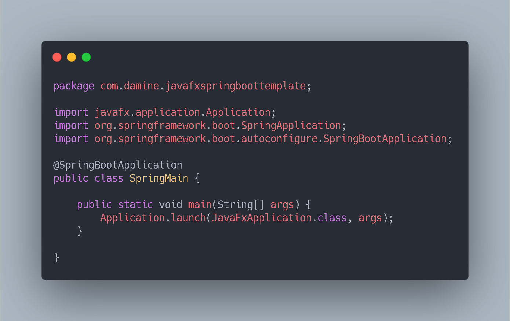
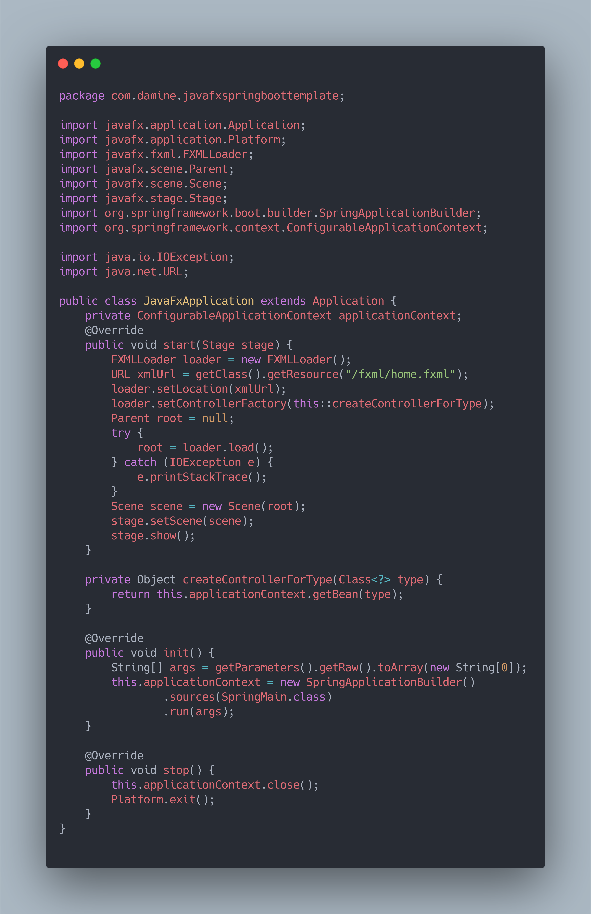
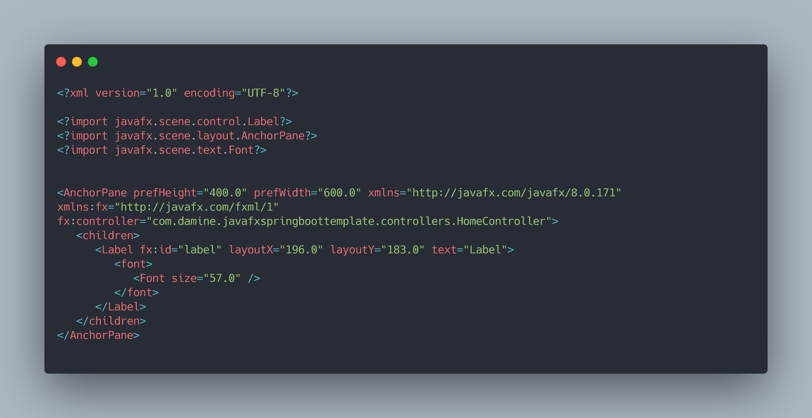
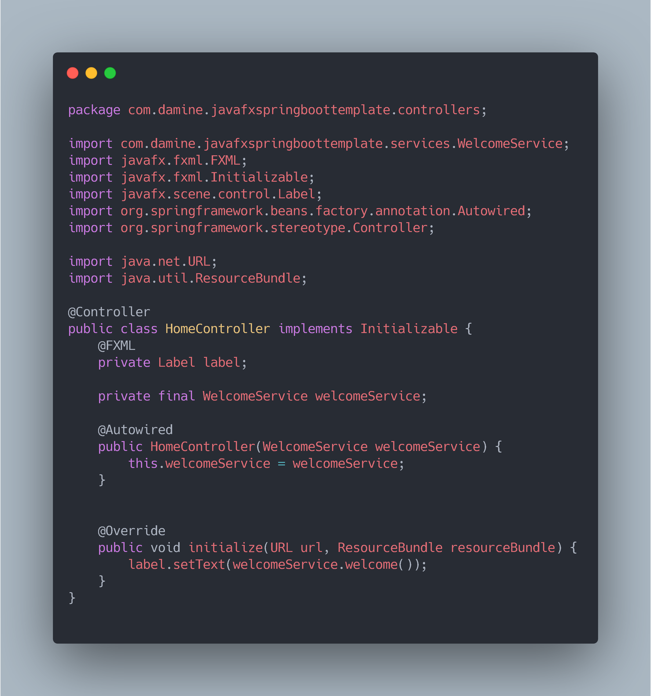
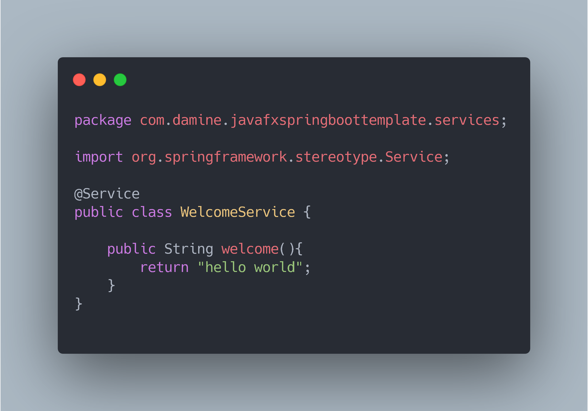
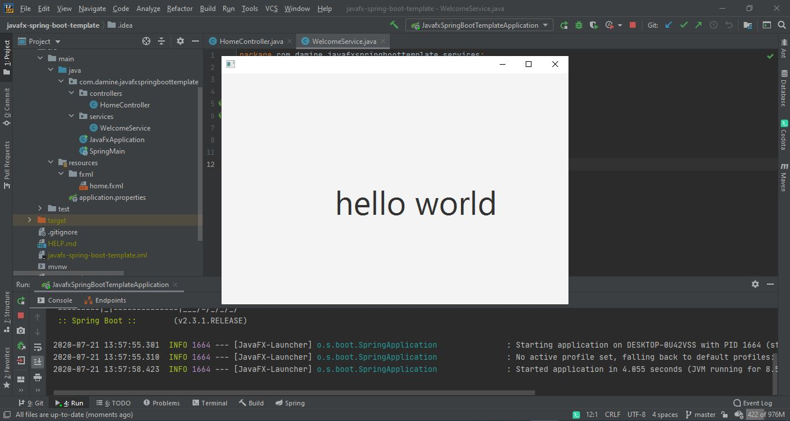
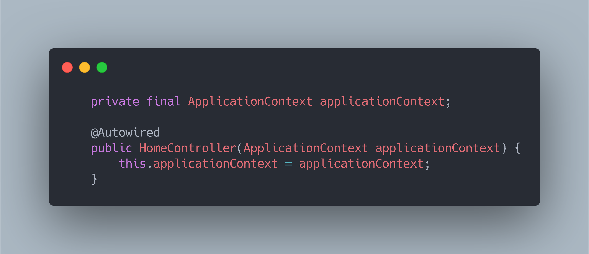
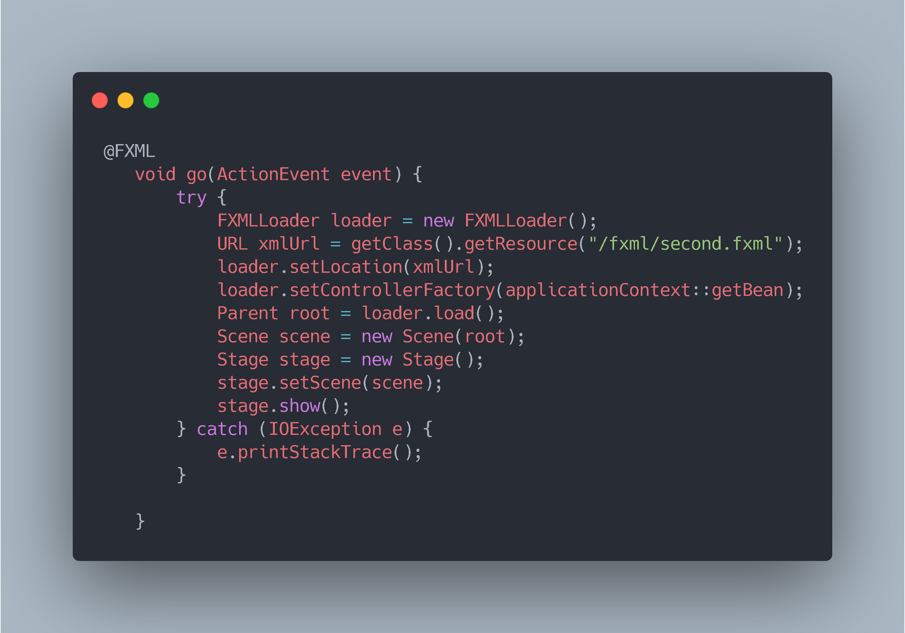
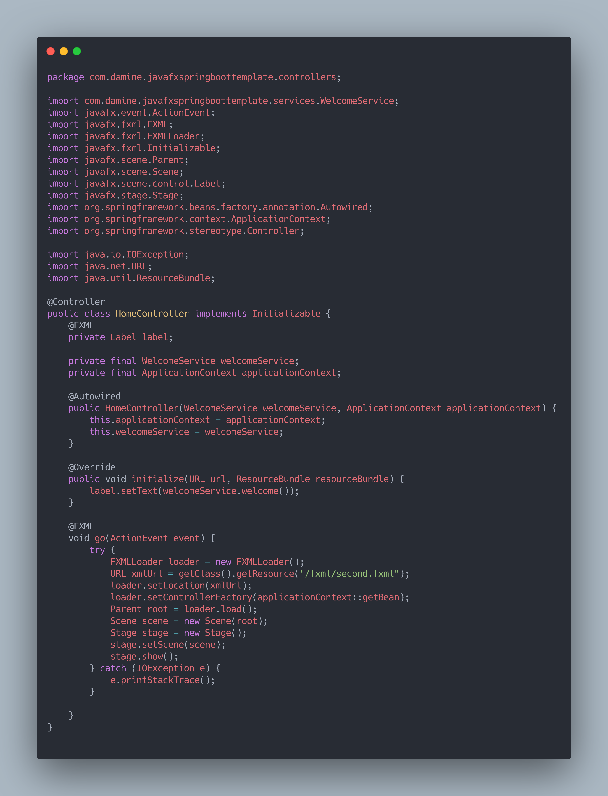

# javafx-spring-boot-template
Integration of JavaFX and Spring Boot template

# create empty spring boot project

# create Spring Main Class

# create JavafxApplication

1) ConfigurableApplicationContext :

   private ConfigurableApplicationContext applicationContext;
   
   One of the implementation of the ApplicationContext container. This container is used for Event Handling propose.
   

# create fxml home

# create HomeController

# Create Welcome Service

# enjoy your first javafx spring boot project

# open second windows

1) @Autowired ApplicationContext

2) load seconf stage 

